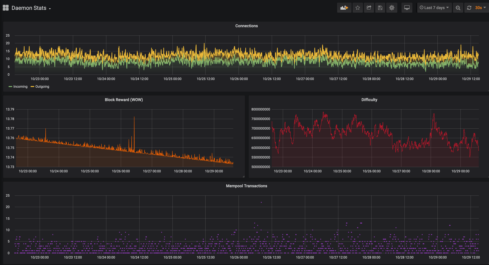

# Wownero

Container image for the official Wownero source code compiled to provide daemon, wallet CLI, and wallet RPC binaries.

## Instructions

Pre-requisites:

* Recent Ubuntu Linux
* `sudo apt-get install docker.io docker-compose`
* `sudo usermod -aG docker $(whoami); logout`

## Node-in-a-box

The simplest way to get started is to use docker-compose and turn up the provided packages, including the Wownero daemon, monitoring tools, and a visualization/graphing tool.

```
cd wownero/ # in this folder
docker-compose up -d
# wownerod available at ports 34567 and 34568
```

You can host the node on an official DNS endpoint for public usage or keep it local for your own private usage.



## Manual Daemon and Wallet Setup

The node and wallet software is in the same package, so both can be used from within the Docker container.

```
# build container image of wownero binaries
docker build -t wownero .

# create network bridge so containers can communicate
docker network create --driver=bridge wownero

# run wownero daemon with RPC bindings
docker run -d --rm --name wownero-daemon \
  --net=wownero \
  -v daemon:/data \
  -p 34568:34568 \
   wownero \
   wownerod \
   --data-dir=/data \
   --rpc-bind-ip=0.0.0.0 \
   --confirm-external-bind \
   --non-interactive

# run wownero-wallet-cli
docker run --rm -it --name wownero-wallet \
  --net=wownero \
  -v wallet:/data \
  wownero \
  wownero-wallet-cli \
    --trusted-daemon \
    --daemon-address wownero-daemon:34568
```
